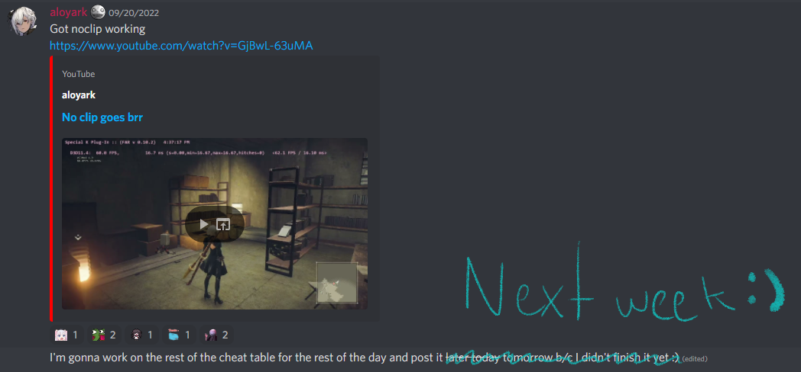
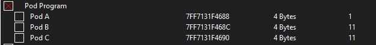
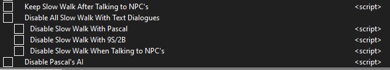

# NieR: Automata Practice Table



# Teleports/Warps

Unlike the 1.01 table where you would have to turn off noclip everytime you teleported, now everything is handled automatically and you can just let cheat engine worry about that.

## Built In Teleports(Put hotkeys in the pictures)

I've made a bunch of teleports for both A Ending and RedDots. You can just activate a script to enable the hotkeys for the warps. I ended up doing the hotkeys through my own script so that 1. you could turn them off and 2. I could have more control over how the hotkeys themselves worked. Having that control made it so that I could handle noclip how I wanted for the warps as well as avoid the janky ass hotkeys in cheat engine. 

There's a castle warp in the A ending warps(`Numpad 8`) but the graphic was half done before I realized I counted the warps wrong and that there were 26 of them, just imagine it's there :)


## Custom Teleports

| Even though there are alot of built in<br/> teleports you'll likely want to have a teleport<br/>somewhere that I didn't set one.<br/>You can set two custom warps, just <br/>activate one of the scripts and use corrisponding <br/>Hotkeys<br/><br/>These warps will persist<br/>as long as you don't deactivate the script or close the game |  |
| ---------------------------------------------------------------------------------------------------------------------------------------------------------------------------------------------------------------------------------------------------------------------------------------------------------------------------------------------- | ------------------------------------------------------------------------------------------------------------------------------------------------- |

# I don't really know how to categorize shit so here's all of the other stuff

### WS Toggle

If you have the WS Toggle Script active you can toggle the WS State between 0 and 1 by pressing `Numpad +`. The script will only update which weapon set you're on and will not bring up the UI in the bottom left.

```
0 being Weapon set 1
1 being Weapon set 2
```

You normally can't swap right away after loading the City Ruins Discovery Save so can use the script to swap weapons that way it'll be how you would have your weapon sets in runs.

### Pod Programs



The values that the Pods have are what Pod Programs that are currently equiped. The picture below is a list of all of the pod programs with numbers in the top right to tell you what value you have to set in cheat engine. This only changes what Program the pod has equiped currently and will not permanently give you the program.


#### Pod Program Toggle

When you load a save that has been made in one of the prologue phases, laser is always unequipped(unless it's before you get the laser). This script just locks the pod program of Pod A to laser so you don't have to equip laser every time you reload.

### No Pod Cooldown

| Nice for if you're new to slowmo <br/>DDG and want to practice or want <br/>to test something |  |
| --------------------------------------------------------------------------------------------- | --------------------------------------------------------------------------------------------------------------------------------------------- |

### Fast Drown Warp

| When this script is active it replaces the slow ass drowning<br/> animation with the fast get up animation. <br/>Not only does this not take forever it<br/>also lets you teleport immediately after you drown.<br/>Comparatively if you try to teleport with the normal<br/>drown warp animation it's really janky and<br/>doesn't work very well. |  |
|:--------------------------------------------------------------------------------------------------------------------------------------------------------------------------------------------------------------------------------------------------------------------------------------------------------------------------------------------------- | --------------------------------------------------------------------------------------------------------------------------------------------- |

### NPC/Slow Walk stuff



`Keep Slow Walk After Talking to NPC's`

- Useful for practicing the early activation on the Eat Ass elevator

- This took like 8 fucking billion years and only like 3 people are gonna use it 

`Disable All Slow Walk Walk With Text Dialogues`

- Pretty much just for testing purposes but I figured I would include it anyway

`Disable Pascal's AI`

- Again Mostly for testing purposes but can be use for some practice scenarios

# Hotkeys

#### Custom Warp Location 1

| Key       | Action                                 |
|:---------:|:--------------------------------------:|
| =         | Key to activate script in cheat engine |
| Shift + C | Save current coords to teleport to     |
| Z         | Teleport to those coords               |

#### Custom Warp Location 2

| Key       | Action                                                        |
|:---------:|:-------------------------------------------------------------:|
| ]         | Key to activate script in cheat engine                        |
| Shift + C | Save current coords to teleport<br/>but like a different warp |
| X         | Teleport to that different warp                               |

## RedDots Warps

| Activate Script | Ctrl + Shift + D |
| --------------- | ---------------- |

| Key      | Place              |
|:--------:|:------------------:|
| 1        | BBJ                |
| 2        | Shit Clip          |
| 3        | FRC/Escalator Clip |
| 4        | Pit Jump           |
| 5        | 007 Plunge         |
| 6        | Under the Pipe     |
| 7        | Oiled Rock         |
| 8        | Reverse Barricade  |
| 9        | Stubby OOB         |
| 0        | Railing Clip       |
| Numpad 1 | Tree Clip          |
| Numpad 2 | Mushroom Clip      |
| Numpad 3 | Castle Skip        |
| Numpad 4 | Castle Plunge      |
| Numpad 5 | Gate Clip          |
| Numpad 6 | Park Plunge        |
| Numpad 7 | Park Box Clip      |
| Numpad 8 | Park to Res Camp   |
| Numpad 9 | Building Climb     |
| F1       | Flooded Plunge     |

## A Ending Warps

| Activate Script | Ctrl + Shift + A |
| --------------- | ---------------- |

| Key      | Place               |
|:--------:|:-------------------:|
| 1        | Crane Skip          |
| 2        | Bridge Skip         |
| 3        | Lava OOB            |
| 4        | Engels Swag         |
| 5        | Wschsengels         |
| 6        | City Ruins Plunge   |
| 7        | Desert Barricade    |
| 8        | Housing Slide       |
| 9        | Desert Housing      |
| 0        | Platformless        |
| Numpad 1 | Early Don           |
| Numpad 2 | Box Clip/Boxless    |
| Numpad 3 | Let's Play          |
| Numpad 4 | Obama Clip          |
| Numpad 5 | Dan's Hole          |
| Numpad 6 | Skype Glitch Plunge |
| Numpad 7 | EDS Voidout         |
| Numpad 8 | Rainbow Road        |
| Numpad 9 | Shore Fight         |
| F1       | CCC                 |
| F2       | Mansplaining        |
| F3       | Eat Ass             |
| F4       | Factory V2          |
| F5       | Wschseng's Elevator |
| F6       | Shabu               |

## Misc

| Key      | Needs Script active | Script                                          |
| -------- | ------------------- | ----------------------------------------------- |
| Numpad 0 | No                  | it's like what we do normally but it's cheating |
| Numpad . | No                  | Infinite Double Jump                            |
| Numpad - | No                  | Infinite Dash                                   |
| Numpad + | Yes                 | WS Toggle                                       |

# Issues

Cheat Engine likes to do this weird thing where it doesn't disable the script(even tho it's unchecked) sometimes and it's really fucking annoying
